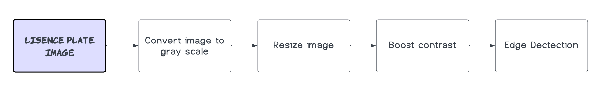
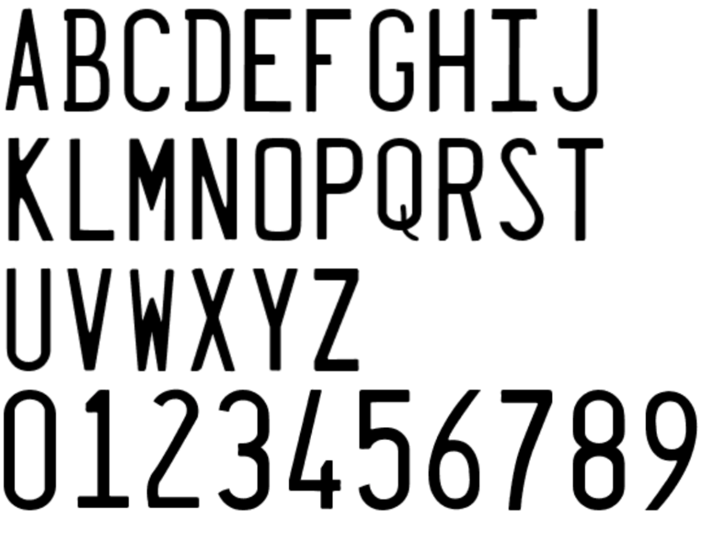
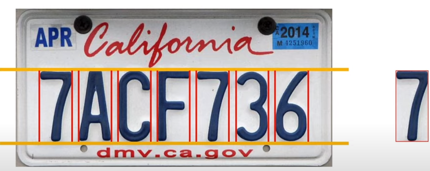

# USC CSCI 596 Final Project

## Description

This project uses Java to recognize license plates parallelly. 

The code was based on and derived from
1. Youtube channel: Oggi AI - Java image filter
   - https://www.youtube.com/playlist?list=PLj8W7XIvO93p1v-f_eSP3yDu4PVK9Pbrt
2. GitHib Page: Joe James
   - https://github.com/joeyajames/Java/tree/master/ALPR
   - https://github.com/joeyajames/Java/tree/master/Image%20Filters

## Contributors

- Kuan-Te (Johnny) Lee
- Yi-Ning (Kenny) Lin
- Yi-Hsuan (Ashley) Chen

## Objective
Train the capital English character and digits in Penitentiary Gothic font.

Give many license plates in California, and use multi threads to recognize them correctly. 

Report the performance profile to see how multi threads in this case can help speed up.

### Image Processing Flow Chart

### Step 1: Training Data

Prepare 4 images containing A-Z and 0-9 in Penitentiary Gothic font.

Convert them to grayscale and resize them to 20 x 43 pixels.

Let the character or digit as the key, and 1D integer array to store the grayscale value as a value.

Append hard-coded character data to training Data to improve accuracy.

### Step 2: Test Data

Load each of the license plat images.

Crop out top and bottom margins.

Use edge detection to separate each character/ digit.

Calculate each character/ digit grayscale value in a 1D integer array.

Use 1NN method to find the nearest neighbor as the output character/ digit.

Compare the output and the label into a file.

### Step 3: Multi threads speed up
Train the data using multi threads.

Test the whole license plate images simultaneously.

Report the performance profile to see how multi threads in this case can help speed up. 

