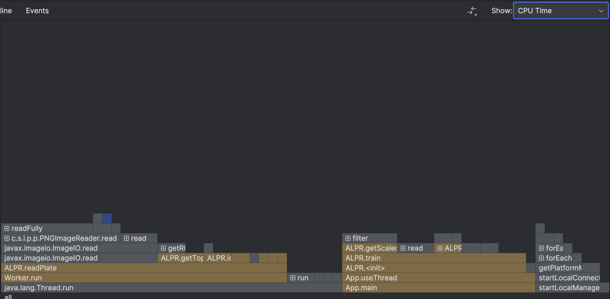

# USC CSCI 596 Final Project (Fall 2023)
This project is implemented in Java to create a model that recognizes license plates in parallel. 

## Objective
- Train our model by offering the capital English character and digits in **Penitentiary Gothic** font.

- Offer the images of license plates in California into our model to recognize license plates' number and turn then into text correctly.

- Use multi-threads to accelerate the process.

- Report the performance profile to identify the bottleneck of the code and evaluate how multi-threads in this case can help us to speed up.

## Description
### Workflow

   

### Step 1: Training Data

   

1. Feed our model with 4 images containing A-Z and 0-9 in **Penitentiary Gothic** font.

2. Convert them to grayscale.

3. Resize them to 20 x 43 pixels.

4. Make the character and digit as the key, and 1D integer array that stores the grayscale pixel value as a value.
   
   [255, 255, 64, 27, 128, ...., 0] length: 860

5. Append hard-coded character data to training Data to improve accuracy.

### Step 2: Test Data

   

1. Load license plate images to trained model.

2. Crop out top and bottom margins.

3. Use edge detection to separate each character and digit.

4. Calculate grayscale value of each character and digit in a 1D integer array.

   [226, 240, 65, 29, 124, ...., 0] length: 860

5. Use 1NN method to find the nearest neighbor as the output character or digit.

6. Compare the output and the label into a file.

### Step 3: Multi-threading speed up
1. Incorporate multi threads method to train our models with data.

2. Recognize abundant of license plate images simultaneously.

3. Report the performance profile to identify the bottle neck of the code and evaluate how multi-threads in this case can help us to speed up.

## Implementation

### Environment
- Operating System: MacOS Sonoma 14.2
- CPU: Apple M1 Pro (10 cores, 3.22GHz)
- Profiling Tool: Intellij Profiler
### Single-Threaded Training, Single-Threaded Recognition
Using the sample code from [2], we used single thread to train and recognize the test data(n = 30) at first. The result is as follows:

| #       | Time(ms) |
|---------|----------|
| 1       |49.05671660043299|
| 2       |46.057362500578165|
| 3       |48.585249999538064|
| 4       |47.26977499946952|
| 5       |46.15939580090344|
| 6       |47.3930583987385|
| 7       |47.39126249961555|
| 8       |47.2568790987134|
| 9       |51.24353750050068|
| 10      |50.26253329962492|
| Average |48.06757707|

### Multi-Threaded Training, Multi-Threaded Recognition (ALPR.java)
With a brief understanding of how the single-threaded program works, we then started to parallelize the program using multi-threading and tried to find the best performance, and we got the following results:

| # of threads | Time(ms)           |
|--------------|--------------------|
|1	| 48.26430410146713  |
|2	| 16.126074999570847 |
|3	| 14.657600000500679 |
|5	| 18.433133399114013 |
|6	| 16.172600001096725 |
|10| 23.696162501350045 |
|15| 32.35087089985609  |
|30| 61.7450833003968   |

One key observation from the above graph is that there is a significant improvement using multi-threading in terms of performance, but as the number of threads gets larger, the run time also increases. Therefore, we used the profiler to do a thorough analysis.

Flame graph using 2 threads:

Flame graph using 30 threads:

Comparing the above two graphs, we can see that using 30 threads will create a huge amount of overhead in ALPR.triain(), the model training process. Hence, we tried the following idea and it turned out to be the best result we can get.

### Single-Threaded Training, Multi-Threaded Recognition (ALPR2.java)
Finally, we decided to use one single thread to train the model to reduce the overhead while still using multi-threads to recognize the plates. The result is as follows:

| # of threads | Time(ms)           |
|-------------|--------------------|
| 1	          | 27.904991699382663 |
| 2	          |12.330941600725055|
| 3	          |8.415737500414252|
| 5	          |5.632704200223088|
| 6	          |5.021720798686147|
| 10	         |4.205070799216628|
| 15	         |5.060437500476837|
| 30	         |4.273858400061727|

## Reference

The code was based on and derived from
- [1] Youtube channel: Oggi AI - Java image filter
   - https://www.youtube.com/playlist?list=PLj8W7XIvO93p1v-f_eSP3yDu4PVK9Pbrt
- [2] GitHub Page: Joe James
   - https://github.com/joeyajames/Java/tree/master/ALPR
   - https://github.com/joeyajames/Java/tree/master/Image%20Filters

## Contributors

- Kuan-Te (Johnny) Lee
- Yi-Ning (Kenny) Lin
- Yi-Hsuan (Ashley) Chen
